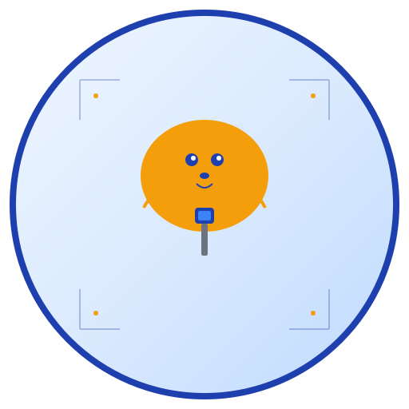

# دليل استخدام الهوية البصرية 🎨

## نظرة سريعة

تم إنشاء هوية بصرية شاملة لمنصة مزاد الحيوانات النادرة. هذا الدليل يوضح كيفية استخدام جميع العناصر.

## 🚀 البدء السريع

### 1. اختبار الهوية البصرية
```bash
# افتح ملف الاختبار في المتصفح
open test-brand.html
```

### 2. عرض الهوية البصرية الكاملة
```bash
# افتح العرض التفاعلي
open brand-showcase.html
```

## 📁 الملفات المتوفرة

```
├── assets/
│   ├── logo.svg          # الشعار الرئيسي (512×512)
│   ├── app-icon.svg      # أيقونة التطبيق (192×192)
│   └── favicon.svg       # أيقونة الموقع (32×32)
├── design-system.css     # نظام التصميم الكامل
├── test-brand.html       # صفحة اختبار سريعة
├── brand-showcase.html   # عرض تفاعلي شامل
├── brand-guidelines.md   # دليل الهوية البصرية
├── BRAND_GUIDELINES.md   # دليل شامل
└── BRAND_SUMMARY.md      # ملخص نهائي
```

## 🎨 كيفية الاستخدام

### في مشروع React
```jsx
// استيراد نظام التصميم
import './design-system.css';

// استخدام الأيقونة


// استخدام الأزرار
<button className="btn btn-primary">زر أساسي</button>
<button className="btn btn-secondary">زر ثانوي</button>

// استخدام البطاقات
<div className="card">
  <div className="card-header">العنوان</div>
  <div className="card-body">المحتوى</div>
</div>

// استخدام التنبيهات
<div className="alert alert-success">تم الحفظ بنجاح!</div>
<div className="alert alert-error">حدث خطأ!</div>
```

### في مشروع HTML عادي
```html
<!DOCTYPE html>
<html lang="ar" dir="rtl">
<head>
    <link rel="stylesheet" href="design-system.css">
    <link href="https://fonts.googleapis.com/css2?family=Cairo:wght@300;400;500;600;700&display=swap" rel="stylesheet">
</head>
<body>
    
    <button class="btn btn-primary">زر أساسي</button>
</body>
</html>
```

### في التطبيق الجوال
```javascript
// استخدام أيقونة التطبيق
// app-icon.svg في مجلد الأصول

// تطبيق الألوان
const colors = {
  primary: '#1e40af',
  secondary: '#f59e0b',
  success: '#10b981',
  error: '#ef4444'
};
```

## 🎯 الألوان الأساسية

### الألوان الرئيسية
```css
--primary-blue: #1e40af    /* الأزرق الأساسي */
--primary-blue-light: #3b82f6
--primary-blue-dark: #1e3a8a

--secondary-gold: #f59e0b  /* الذهبي الثانوي */
--secondary-gold-light: #fbbf24
--secondary-gold-dark: #d97706

--neutral-gray: #6b7280    /* الرمادي المحايد */
--neutral-gray-light: #9ca3af
--neutral-gray-dark: #374151
```

### ألوان الحالة
```css
--success-green: #10b981   /* النجاح */
--warning-orange: #f59e0b  /* التحذير */
--error-red: #ef4444       /* الخطأ */
--info-blue: #3b82f6       /* المعلومات */
```

## 🔤 الخطوط

### العربية
```css
font-family: 'Cairo', 'Noto Sans Arabic', sans-serif;
```

### الإنجليزية
```css
font-family: 'Inter', 'Roboto', sans-serif;
```

## 🧩 المكونات الجاهزة

### الأزرار
```html
<button class="btn btn-primary">زر أساسي</button>
<button class="btn btn-secondary">زر ثانوي</button>
<button class="btn btn-outline">زر محيطي</button>
<button class="btn btn-ghost">زر شفاف</button>

<!-- أحجام مختلفة -->
<button class="btn btn-primary btn-sm">صغير</button>
<button class="btn btn-primary btn-lg">كبير</button>
```

### البطاقات
```html
<div class="card">
  <div class="card-header">
    <h3>عنوان البطاقة</h3>
  </div>
  <div class="card-body">
    <p>محتوى البطاقة</p>
  </div>
  <div class="card-footer">
    <button class="btn btn-primary btn-sm">إجراء</button>
  </div>
</div>
```

### التنبيهات
```html
<div class="alert alert-success">تم الحفظ بنجاح!</div>
<div class="alert alert-warning">تحذير: يرجى التحقق من البيانات</div>
<div class="alert alert-error">خطأ: حدث خطأ أثناء الحفظ</div>
<div class="alert alert-info">معلومة: يمكنك التحديث لاحقاً</div>
```

### الشارات
```html
<span class="badge badge-primary">أساسي</span>
<span class="badge badge-secondary">ثانوي</span>
<span class="badge badge-success">نجح</span>
<span class="badge badge-warning">تحذير</span>
<span class="badge badge-error">خطأ</span>
```

### النماذج
```html
<div class="form-group">
  <label class="form-label">الاسم الكامل</label>
  <input type="text" class="form-input" placeholder="أدخل اسمك">
</div>
```

## 📐 المسافات والهوامش

```css
--spacing-xs: 0.25rem;   /* 4px */
--spacing-sm: 0.5rem;    /* 8px */
--spacing-md: 1rem;      /* 16px */
--spacing-lg: 1.5rem;    /* 24px */
--spacing-xl: 2rem;      /* 32px */
--spacing-2xl: 3rem;     /* 48px */
```

## 🔄 الانتقالات والحركات

```css
--transition-fast: 150ms ease-in-out;
--transition-normal: 250ms ease-in-out;
--transition-slow: 350ms ease-in-out;
```

## 📱 الاستجابة

النظام يدعم الاستجابة تلقائياً:
- **الهواتف**: أقل من 640px
- **الأجهزة اللوحية**: 641px إلى 1024px
- **الشاشات الكبيرة**: أكثر من 1025px

## 🎨 الوضع المظلم

```css
[data-theme="dark"] {
  --bg-primary: #111827;
  --text-primary: #f9fafb;
  /* ... باقي الألوان */
}
```

## 🚫 ما يجب تجنبه

- ❌ استخدام ألوان غير العلامة التجارية
- ❌ تغيير نسب الأيقونة
- ❌ استخدام خطوط غير محددة
- ❌ إضافة تأثيرات غير ضرورية

## ✅ أفضل الممارسات

- ✅ الحفاظ على تناسق الألوان
- ✅ استخدام المسافات المحددة
- ✅ الحفاظ على وضوح النصوص
- ✅ اختبار التصميم على مختلف الأجهزة

## 🧪 الاختبار

### اختبار سريع
```bash
# افتح ملف الاختبار
open test-brand.html
```

### اختبار شامل
```bash
# افتح العرض التفاعلي
open brand-showcase.html
```

## 📞 الدعم

للاستفسارات حول الهوية البصرية:
- **البريد الإلكتروني**: design@rareauction.ly
- **الفريق**: فريق التصميم - Manus AI
- **التحديثات**: يتم تحديث الدليل دورياً

## 📄 الترخيص

جميع الأصول البصرية محمية بحقوق النشر وتستخدم حصرياً في مشاريع منصة مزاد الحيوانات النادرة.

---

**تم تطوير هذا الدليل بواسطة فريق Manus AI** 🚀
**تاريخ التحديث**: 10 أغسطس 2024
**الإصدار**: 1.0.0
